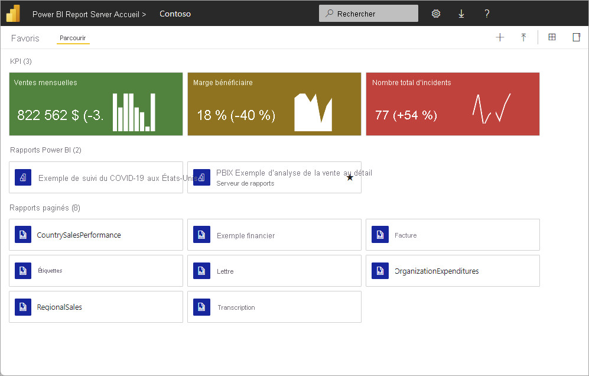

POWER BI REPORT SERVER
======================

POWER BI REPORT SERVER va nous permettre de publier des rapports Power BI **sur un serveur local**.
Les rapports sont distribués derrière le pare feu de l´organisation et non sur le cloud mais il est possible de migrer vers le Cloud.

   *INTERFACE POWER BI REPORT SERVER*

Power BI Report Server ressemble à la fois à **SQL Server Reporting Services et au service en ligne Power BI**, mais avec quelques différences. 

Comme le service Power BI, Power BI Report Server héberge :

* des rapports Power BI (.pbix)

* des fichiers Excel

* des rapports paginés (.rdl)

 Comme Reporting Services, Power BI Report Server est **installé localement**. 
 
 Les fonctionnalités de Power BI Report Server sont un sur-ensemble de Reporting Services : tout ce que vous pouvez faire dans Reporting Services, vous pouvez aussi le faire avec Power BI Report Server, avec **en plus la prise en charge des rapports Power BI**.