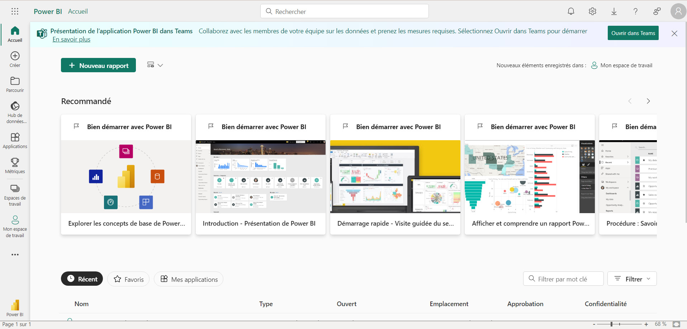
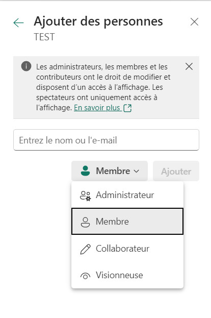

POWER BI SERVICE
================

DANS POWER BI
--------------

**Power BI Service** est une plateforme collaborative développée par Microsoft, complémentaire à l’application Power BI Desktop.
Elle offre la possibilité à ses utilisateurs de **consommer, partager, actualiser ou distribuer des rapports, des jeux de données ou encore des tableaux de bord Power BI**.

.. note::
   📢❗🚨 À noter que pour accéder aux services de Power BI, il est nécessaire de détenir un compte Power BI Pro ou Power BI Premium.

.. figure::  images/PBIservice.jpg
   :align:   center

   *POWER BI SERVICE.*

INTERFACE ET FONCTIONNALITES POWER BI SERVICE
---------------------------------------------

   *INTERFACE POWER BI SERVICE : PAGE ACCUEIL.*

L’interface utilisateur de Power BI Service est clair, fonctionnel, structuré et se compose de plusieurs éléments. Sur le volet de gauche, nous pouvons retrouver :

* **La page d’accueil**
  Elle concentre un résumé de tous les éléments présents sur la plateforme tels que les activités récentes des membres, par exemple.

* **Les favoris**
  Ils permettent de sauvegarder un certain nombre de contenus (rapports, jeux de données), qui peuvent être plus facilement trouvés par les membres de l’équipe.

* **La catégorie « Récent »**
  Elle permet de visualiser les derniers contenus utilisés par les membres de l’équipe, qu’il s’agisse d’un espace de travail, d’un tableau de bord, d’un rapport ou encore d’un jeu de données.

* **La fonction « Créer »**
  Il est possible de créer des rapports sur Power BI Service, bien qu’il ne s’agisse pas de sa fonction première. Pour créer un rapport sur Power BI Service, il existe **deux méthodes**.
  * D’une part, vous avez la possibilité de créer un rapport à partir d’un fichier local, c’est-à-dire un fichier de données directement stocké sur votre ordinateur. À noter que le fichier en question peut prendre différentes formes (Excel, SQL ect …).
  * D’autre part, vous pouvez utiliser un jeu de données qui a déjà été publié sur Power BI Service. Vous remarquerez que Power BI Service à une interface très similaire à Power BI Desktop, avec le canevas central où vous pouvez visualiser en direct votre rapport de données, le volet « champs » où apparaît toutes les colonnes de votre jeu de données, la fenêtre « Visualisations » avec tous les outils et visuels à votre disposition, ainsi que la section « Filtres ».

.. warning::
   ⚠️ Cependant, nous ne pouvons pas accéder à Power Query, ni même à la vision des données et aux modèles. De ce fait, créer un rapport sur Power BI Service est peu recommandé.

* **Jeux de données**
  Cette catégorie permet aux utilisateurs de Power BI Service de visualiser l’ensemble des jeux de données utilisés ou partagés par les membres d’une équipe.

* **Les applications**
  Les applications Power BI offrent toute une collection de rapports et de tableaux de bord préétablis, avec des jeux de données déjà inclus dans l’application ou qu’il est possible de connecter soi-même. Pour en savoir plus, rendez-vous sur notre article : L’utilisation des applications Power BI Service.

* **L’option « Partagé avec moi »**
  Au même titre que les jeux de données, nous retrouvons également les rapports partagés. Cet onglet rassemble tout simplement les rapports des autres membres de l’équipe, qui ont décidé de partager leur rapport de données avec vous.

* **La section « Apprenez »**
  Cette catégorie permet aux utilisateurs de recevoir l’aide dont ils ont besoin quant à l’utilisation de Power BI Service, avec notamment de la documentation ou une fiche explicative sur l’utilisation de l’outil. Il est également possible de participer à la communauté Power BI, qui s’apparente à un forum ou à une foire aux questions.

* **Les espaces de travail Power BI Service**
  Les espaces de travail sont une des parties principales de Power BI Service. Ils permettent de stocker l’ensemble des contenus Power BI. Chaque compte Power BI Service possède un espace de travail dédié, intitulé « Mon espace de travail ».

.. note:: 
   **L’espace de travail Power BI Service** (workspace) peut notamment être **partagé**. Pour ce faire, rendez-vous sur votre espace personnel et cliquez sur l’onglet « Accès ». Vous pourrez alors identifier les membres avec qui vous souhaitez partager votre espace, définir les rôles attribués à chacun, ainsi que les autorisations d’utilisations (Administrateur, membre, collaborateur, visionneuse).

   *ACCES WORKSPACE POWER BI SERVICE.*

POWER BI DESKTOP vs SERVICE
===========================
POINTS COMMUNS ET DIFFERENCES entre Power BI Desktop et Power BI Service
------------------------------------------------------------------------

**POINTS COMMUNS** :

* Création de rapports

* Création de visualisation

* Gestion de la sécurité 

* Application de filtres

**DIFFERENCES**

* Seul **Power BI Desktop** va permettre de :

  * Transformer et de nettoyer les données

  * Modéliser les données

  * Ajouter des calculs

  * Intégrer un thème

  * Créer des rôles liés à la sécurité

* Seul **Power BI Service** va nous permettre de :

  * Créer des tableaux de bord

  * Créer des applications et Workspaces

  * Partager le contenu créé

  * Gérer des rôles et affecter des utilisateurs aux rôles prédéfinis